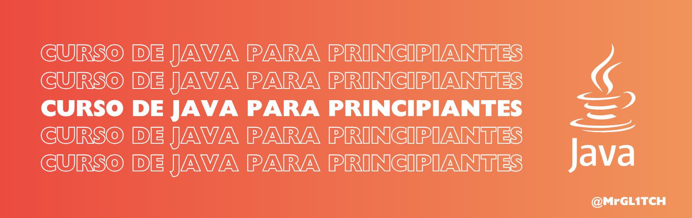

# Curso de Java para Principiantes

# Bienvenido al curso básico de **Java para principiantes**

Diseñado para aprender paso a paso, con teoría explicada de forma clara, ejemplos comentados y ejercicios prácticos.

> Ideal para estudiantes, autodidactas o quienes se preparan para entrevistas técnicas (como Amazon, Google, etc.).

---

## Objetivo del curso

Este curso tiene como objetivo ayudarte a:

- Aprender los fundamentos de Java con ejemplos simples y explicativos.
- Practicar cada tema con ejercicios diseñados para reforzar la lógica y comprensión.
- Prepararte para retos reales, entrevistas o cursos avanzados de programación.

---

## Formato del curso

Cada módulo del curso contiene:

- **Explicación teórica** en un archivo `README.md`.
- **Ejercicios resueltos** con comentarios educativos.
- **Retos para practicar** por tu cuenta.

> Todos los ejercicios están diseñados con un enfoque didáctico, usando comentarios paso a paso para facilitar la comprensión.

---

## Temario del curso

| Módulo | Tema                                   | Descripción breve                                    |
|--------|----------------------------------------|------------------------------------------------------|
| 01     | `print` en Java                      | Cómo imprimir texto en consola. Secuencias especiales. |
| 02     | Variables y Tipos de Datos           | Declaración de variables, tipos primitivos.          |
| 03     | Operadores                           | Aritméticos, lógicos, comparación, asignación.       |
| 04     | Condicionales `if`, `else`           | Decisiones simples y múltiples.                      |
| 05     | `switch`                             | Alternativa para múltiples opciones.                 |
| 06     | Ciclos `while` y `do-while`          | Repetición basada en condiciones.                    |
| 07     | Ciclo `for`                          | Ciclos con contador.                                 |
| 08     | Arreglos (Arrays)                    | Almacenar múltiples valores del mismo tipo.          |
| 09     | Métodos (Funciones)                  | Modularizar el código y reutilizar lógica.           |
| 10     | Entrada del usuario (`Scanner`)    | Leer datos desde la terminal.                        |
| 11     | Clases y Objetos                     | Introducción a la programación orientada a objetos.  |
| 12     | Encapsulamiento y modificadores      | `public`, `private`, getters y setters.              |
| 13     | Constructores                        | Inicializar objetos al crearlos.                     |
| 14     | Herencia y polimorfismo              | Extender clases y redefinir métodos.                 |
| 15     | Manejo de errores (`try-catch`)      | Capturar y manejar excepciones.                      |
| 16     | Proyecto Final                       | Mini proyecto aplicando todo lo aprendido.           |

> ❗Proyecto en curso! Módulos en desarrollo.
---

## ¿Cómo usar este curso?

Puedes seguir los módulos desde tu navegador usando [Replit](https://replit.com/languages/java10), o instalar un entorno local:

1. Instala [Java JDK](https://www.oracle.com/java/technologies/javase-downloads.html).
2. Usa un editor como [VS Code](https://code.visualstudio.com/), [Eclipse](https://www.eclipse.org/) o [Cursor](https://www.cursor.so).
3. Descarga o clona este repositorio.
4. Abre el archivo README.md del módulo que estés estudiando, dentro vendrá toda la teoría, ejemplos y ejercicios por resolver.
5. Usa los archivos `.java` para resolver los ejercicios.

> Todos los archivos para resolver ejercicios están nombrados como `EjercicioNModuloXX.java`.

## Requisitos previos

No necesitas conocimientos previos de programación, este curso comienza desde cero.  
Lo que sí recomiendo es 

## ¿Qué aprenderás al finalizar este curso?

- Conocerás la sintaxis y estructura básica de Java.
- Podrás construir programas que lean datos, tomen decisiones y repitan acciones.
- Comprenderás los fundamentos de la programación orientada a objetos.
- Tendrás una base sólida para cursos intermedios o aplicar a vacantes de trainee/junior.

## ¿Te gustaría contribuir?

Si tienes sugerencias, errores corregidos o nuevas ideas, puedes abrir un _issue_ o enviar un _pull request_.

> Revisa [CONTRIBUTING.md](CONTRIBUTING.md) para más detalles.

## Licencia

Este proyecto está bajo la licencia [MIT](LICENSE).

## Agradecimientos

Gracias por tomarte el tiempo de estudiar con este curso.  
Recuerda: **el aprendizaje viene de intentarlo**.  
Practica, explora y no tengas miedo de fallar. Cada línea de código te acerca más a dominar Java.

---

## Autor

Creado por [MrGL1TCH](https://github.com/MrGL1TCH)  
México – Me encanta ayudar, solucionar, mejorar y aprender constantemente.

